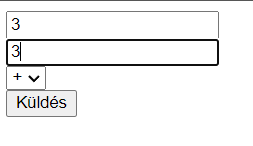
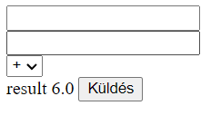

#Szervlet Számológép

#Alkalmazás célja:

Egy működőképes számológép web alkalmazás, ami tud: összeadni, kivonni, szorozni és osztani. Ennek a megoldása servlet és jsp techonológiával történt.

#Mükődése:

A projektet leklónozva és a szamologep_servlet projektet megnyitva, a Maven Lifecycle -> installálás paranccsal létrehozzunk egy target mappát amiben is a szamologepservelet.jar át tudjuk másolni a Tomcat webapps mappában ahol a Tomcat elindítása után az alkalmazásunk el tud indulni.

Útvonal: http://localhost:8080/szamologepservlet   

### Példa:

 

